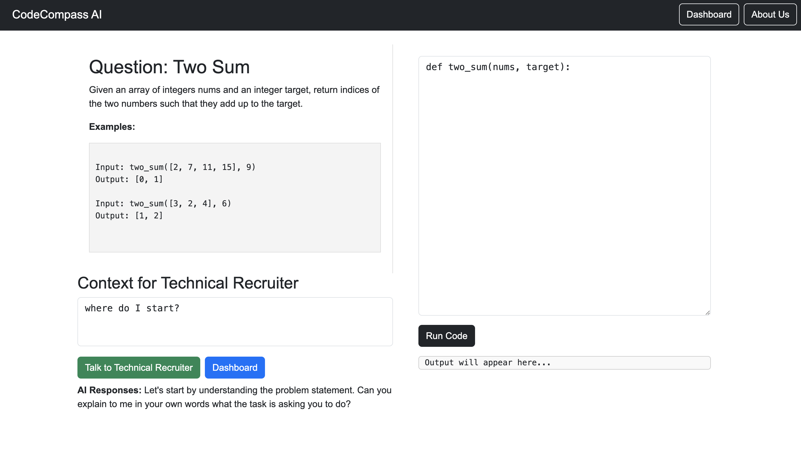
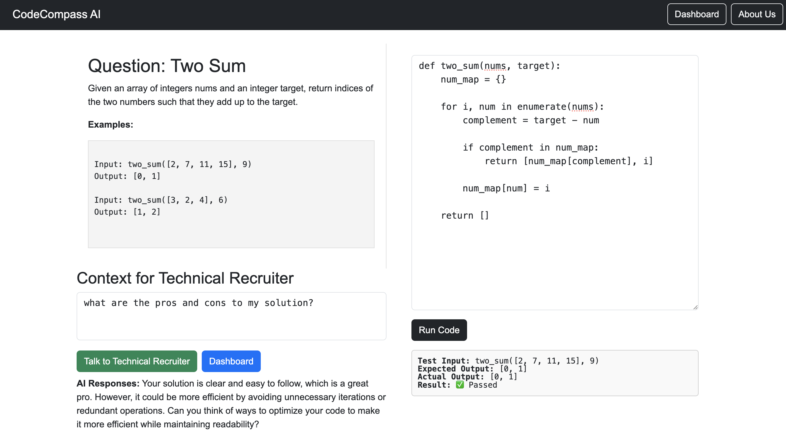

# CodeCompass

**CodeCompass** is an AI-powered LeetCode assistant designed to help users solve coding problems more efficiently. Built using Python and Flask, it provides real-time solutions, detailed explanations, all through a user-friendly web interface. 

Made for Nosu Hackathon. What a fun opportunity to practice my skillset.

## Our Live Website

[CodeCompass Live Platform](https://codecompass-17r4.onrender.com)

## Preview

In this image, the user is starting their question, receiving guidance from the technical recruiter.



Here, the user is complete the question and feedback is given. The user also compiles and
the results of the test cases are compiled.



## Features

- **AI Assistance**: Offers real-time coding assistance tailored to LeetCode problems.
- **Problem Explanations**: Provides detailed walkthroughs and insights into coding challenges.
- **Web-Based Interface**: Easily accessible via any browser, no installation required.

---

## Hackathon Objectives

Our primary goal for the hackathon is to deliver a functional prototype of **CodeCompass** with the following features:

### Web-Based MVP

- A Flask-powered backend that serves AI-driven coding solutions.
- Seamless real-time assistance for solving coding problems.

### Core Functionalities

- AI-powered problem-solving and detailed explanations.
- A scalable architecture capable of supporting multiple users simultaneously.


## Future Improvements

As we continue to enhance **CodeCompass**, here are some planned improvements (by priority):

1. **LeetCode API Integration**:
   - Automate fetching all LeetCode questions, including problem details, tags, and difficulty levels.
   - Keep the question database up to date with the latest additions and updates from LeetCode.
   - 50+ tests per application. Right now, single-handly verifying one.

2. **User Progress Tracking**:
   - Implement user authentication and profiles.
   - Track individual progress, including solved questions, success rates, and time spent on problems.
   - Provide personalized recommendations based on user performance and history.

3. **Leaderboard and Community Features**:
   - Add global and friend-specific leaderboards to foster healthy competition.
   - Create a community forum for users to discuss solutions, share tips, and collaborate.

4. **Performance Optimizations**:
   - Improve backend scalability to handle higher user loads seamlessly.
   - Optimize response times for real-time AI assistance.

5. **Mobile-Friendly Design**:
   - Develop a responsive interface to ensure smooth usability on both desktop and mobile devices.

6. **Gamification**:
   - Introduce badges, achievements, and streaks to keep users motivated and engaged.

## Steps to Run Locally

1. **Clone the Repository**:
   ```bash
   git clone <repository_url>
   cd CodeCompass
   ```

2. **Set Up a Virtual Environment**:
   ```bash
   python -m venv venv
   source venv/bin/activate   # On Windows, use 'venv\Scripts\activate'
   ```

3. **Install Dependencies**:
   ```bash
   pip install -r requirements.txt
   ```

4. **Run the Application**:
   ```bash
   python code_editor_app/app.py
   ```

5. **Access the Application**:
   Open your browser and navigate to `http://127.0.0.1:5000`.

---

These enhancements aim to make **CodeCompass** an indispensable tool for LeetCode enthusiasts, competitive programmers, and anyone looking to improve their problem-solving skills.

**Note**: This application is deployed on a free hosting platform, so it may take up to **60 seconds** to load. Thank you for your patience! Also, please be mindful of how many tokens you use <3.
